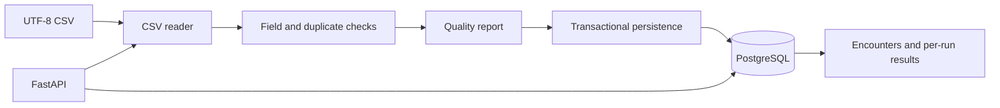

# Architecture

One Python application and one PostgreSQL database process small synthetic
encounter files. There are no patient identities, clinical decisions, or AI
features. The project demonstrates data engineering and backend correctness.

## Data flow

`EncounterRow` preserves strings and logical row numbers. The reader checks
headers, column counts, encoding, and unsupported NUL characters. UTF-8 BOMs,
quoted commas, and multiline values are supported. An unreadable file aborts
before storage. The validator trims copies and collects all independent issues.
Missing fields receive required-field errors without redundant format errors.
Code checks validate a documented subset of syntax, not code-set membership.

A report counts invalid records by source row number. Encounter IDs cannot be
used for that count because they can be missing or duplicated. Every occurrence
of an in-file duplicate is rejected. Multiple errors on one row count as one
invalid record. Accepted rows are trimmed and dates converted before insertion.

## Database and atomicity

- `encounters`: accepted records; encounter ID is the primary key.
- `ingestion_runs`: source filename, timestamp, and completed summary counts.
- `validation_issues`: run-linked details with logical CSV row numbers.

Foreign keys connect records/issues to their run. Issue encounter IDs do not
reference accepted encounters: rejected rows need not exist in that table.
Parameterized SQL separates data from commands. One transaction saves the entire
run, including accepted rows and issues, or rolls it back on an unexpected error.
`ON CONFLICT DO NOTHING RETURNING` catches existing IDs without overwriting them,
including simultaneous insert attempts. Each upload creates a new run, even if
it accepts no rows. Sequence gaps after rollback are normal.

## API

Six endpoints cover liveness, upload, paginated encounter listing, encounter
lookup, run summary, and run issues. Response models document dates and fields.
Synchronous routes match the synchronous database driver. Each request opens a
connection; pooling is unnecessary at this scale. The upload is limited to 1 MiB
for application processing; multipart handling happens before that check.

`INGEST_API_KEY`, when configured, requires `X-Ingest-Key` only for writes.
Configure it on Azure; local use can omit it. This small demo control is not a
full identity system. Do not ingest real healthcare data. Public read endpoints
expose only invented records. Database errors return generic messages without
connection strings or SQL internals. `/health` checks liveness, not DB readiness;
verify DB readiness by retrieving encounters and a saved report.

## Local containers and CI

Docker Compose starts API and PostgreSQL after a database health check. A named
volume persists records. The SQL initialization file is baked into the database
image, avoiding macOS bind-mount sharing requirements. It runs only on an empty
volume; this project does not implement automatic schema migrations.

GitHub Actions installs Python 3.12 and starts a temporary PostgreSQL 17 service.
It runs unit, API, integration, real-commit, and concurrent-insertion tests with
warnings treated as errors. Test schemas isolate fixtures from demo tables.
Most tests roll back; commit tests explicitly remove only their generated schema.

## Azure target and tradeoffs

Linux B1 App Service plus PostgreSQL Flexible Server B1ms, 32 GB, in West US 2.
The target uses native Python ZIP deployment with build automation, not Docker
Compose in the cloud. Docker remains the local workflow. This avoids a registry
and additional infrastructure. The schema is initialized explicitly, credentials
live in App Service settings, TLS is used for DB connections, and firewall rules
allow only the app outbound addresses plus a temporary setup address.

The retail base estimate is $28.16 for 30 days, with a $35 planning allowance.
No high-availability replica, paid monitoring workspace, custom domain, private
endpoint, or registry is required. Actual availability/credit must be checked
before creation. Current deployment is blocked by a canceled Free Trial; see
DEPLOYMENT.md. No live Azure behavior has been verified.

Alternatives considered: an ORM hides SQL without much benefit for three tables;
SQLite cannot verify PostgreSQL constraints/concurrency; a VM would require OS
maintenance; Kubernetes, queues, and microservices exceed this dataset's needs.
Direct Python functions keep the pipeline teachable and testable.
